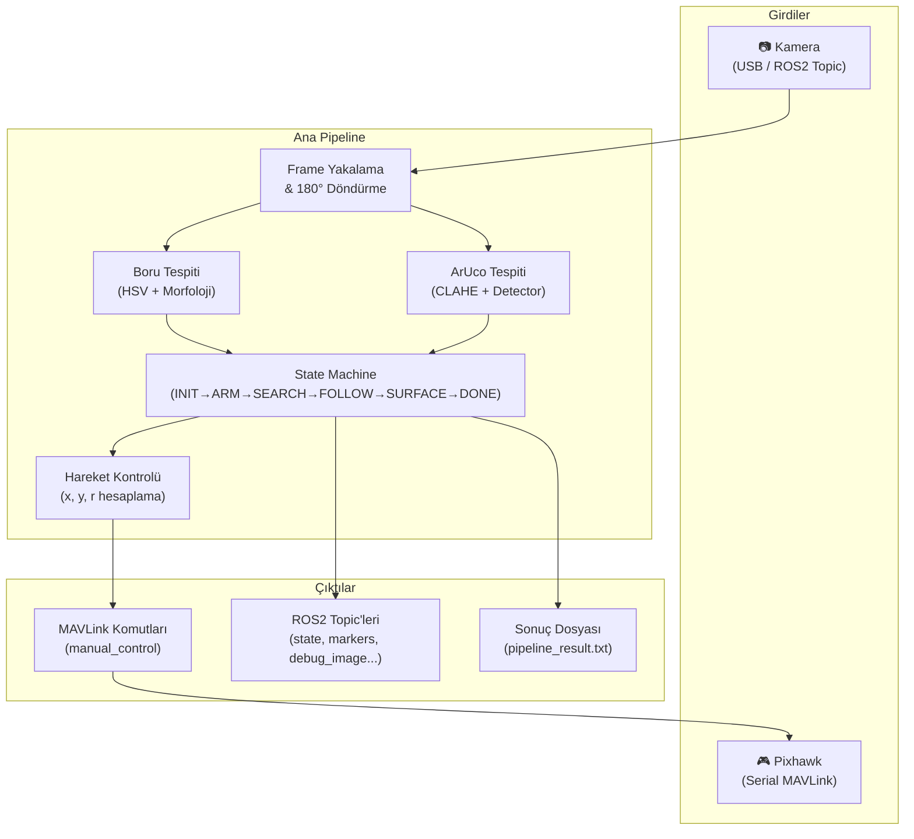
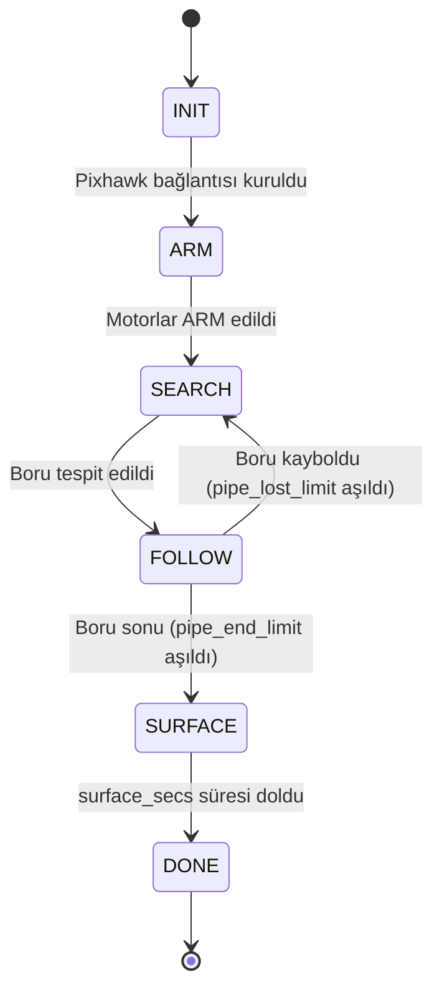
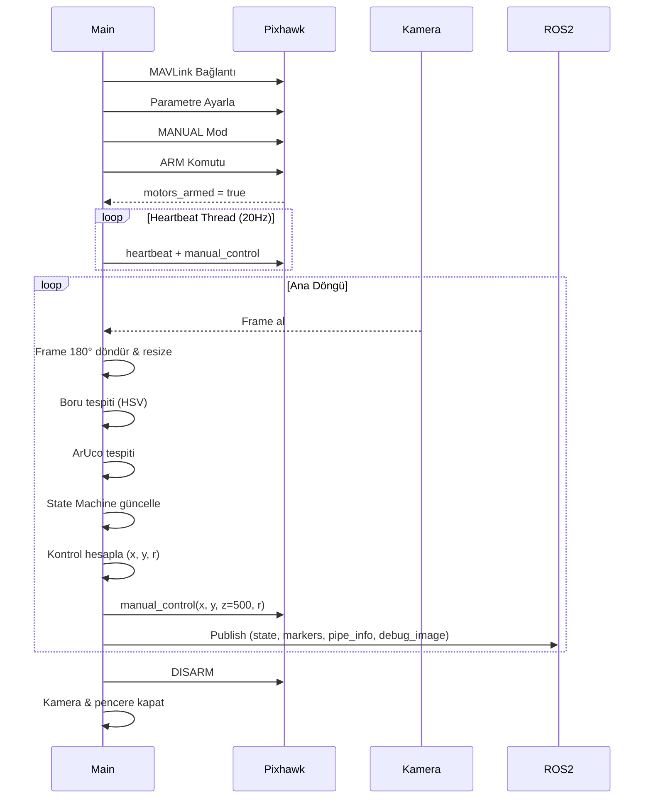

# TAC Challenge 2026 — Otonom Boru Hattı Denetim Sistemi

> **Dosya:** `tac_autonomous_ros2.py`
> **Platform:** Su altı ROV (Remotely Operated Vehicle)
> **İletişim:** pymavlink (serial) + ROS2 (rclpy)
> **Dil:** Python 3

---

## 📖 İçindekiler

- [Genel Bakış](#genel-bakış)
- [Mimari Diyagram](#mimari-diyagram)
- [Bağımlılıklar](#bağımlılıklar)
- [Çalıştırma Modları](#çalıştırma-modları)
- [State Machine (Durum Makinesi)](#state-machine-durum-makinesi)
- [Görüntü İşleme Pipeline'ı](#görüntü-işleme-pipelineı)
- [Hareket Kontrol Sistemi](#hareket-kontrol-sistemi)
- [ROS2 Entegrasyonu](#ros2-entegrasyonu)
- [Tüm Parametreler](#tüm-parametreler)
- [Yardımcı Sınıflar](#yardımcı-sınıflar)
- [MAVLink Katmanı](#mavlink-katmanı)
- [Debug Görüntüsü](#debug-görüntüsü)
- [Görev Sonucu](#görev-sonucu)
- [Klavye Kontrolleri](#klavye-kontrolleri)

---

## Genel Bakış

Bu kod, **TAC Challenge 2026** yarışması için geliştirilmiş bir **otonom su altı boru hattı denetim** sistemidir. Bir ROV (su altı aracı), su altındaki boruyu **kamera görüntüsüyle tespit eder**, boru boyunca **otonom olarak ilerler**, boru üzerindeki **ArUco marker'larını sırasıyla okur** ve görev tamamlandığında **su yüzeyine çıkar**.

### Ne Yapar?

1. **Pixhawk uçuş kontrolcüsüne** seri port üzerinden bağlanır (MAVLink protokolü)
2. Motorları **ARM** eder (çalıştırır)
3. Kameradan aldığı görüntüde **yeşil boruyu** HSV renk filtresiyle tespit eder
4. Boru hattını **takip ederek** ilerler, köşelerde yön değiştirir
5. Boru üzerindeki **ArUco marker'larını** okur ve sırasını kaydeder
6. Boru bittiğinde veya tüm marker'lar okunduğunda **yüzeye çıkar**
7. Sonuçları hem **terminale** hem **dosyaya** yazar

---

## Mimari Diyagram



---

## Bağımlılıklar

| Paket | Kullanım |
|-------|----------|
| `opencv-python` (cv2) | Görüntü işleme, ArUco tespiti, debug görüntüsü |
| `numpy` | Sayısal hesaplamalar, HSV maskeleme |
| `pymavlink` | Pixhawk ile MAVLink seri iletişim |
| `rclpy` | ROS2 Python istemci kütüphanesi |
| `cv_bridge` | OpenCV ↔ ROS2 Image mesaj dönüşümü |
| `std_msgs`, `geometry_msgs`, `sensor_msgs` | ROS2 mesaj tipleri |

---

## Çalıştırma Modları

Kod **üç farklı şekilde** çalıştırılabilir:

### 1. Standalone (Bağımsız) Mod

```bash
python3 tac_autonomous_ros2.py
```

- ROS2 `rclpy.init()` ile başlatılır ama harici herhangi bir ROS2 altyapısına ihtiyaç duymaz
- Kamera doğrudan **USB (OpenCV VideoCapture)** ile açılır
- Varsayılan cihaz: `/dev/ttyACM0`, kamera: `0`

### 2. ROS2 Run ile

```bash
ros2 run tac_challenge tac_autonomous_ros2
```

- ROS2 paketi olarak çalıştırılır
- Tüm ROS2 topic'leri aktif olur
- Varsayılan parametreler kullanılır

### 3. ROS2 Parametreli Çalıştırma

```bash
ros2 run tac_challenge tac_autonomous_ros2 --ros-args \
  -p device:=/dev/ttyACM0 \
  -p baud:=115200 \
  -p hmin:=15 -p hmax:=82 \
  -p smin:=101 -p vmin:=143 \
  -p use_ros_camera:=true \
  -p camera_topic:=/camera/image_raw \
  -p no_display:=true
```

- Tüm parametreler `-p` ile override edilebilir
- `use_ros_camera:=true` ile kamera, ROS2 topic'inden alınır (USB yerine)
- `no_display:=true` ile GUI penceresi kapatılır (headless çalışma)

### Kamera Kaynağı Seçenekleri

| Parametre | Değer | Kaynak |
|-----------|-------|--------|
| `use_ros_camera` | `false` (varsayılan) | USB kamera — OpenCV `VideoCapture(camera_id)` |
| `use_ros_camera` | `true` | ROS2 topic — `/camera/image_raw` (veya `camera_topic` parametresi) |

> [!NOTE]
> ROS2 kamera modu kullanıldığında, gelen frame `cv_bridge` ile OpenCV formatına dönüştürülür ve thread-safe bir kilit (`threading.Lock`) ile ana döngüye aktarılır.

---

## State Machine (Durum Makinesi)

Sistem, 7 durumdan oluşan bir **sonlu durum makinesi** ile yönetilir:



### Durum Detayları

#### `INIT` — Başlatma

- Pixhawk'a seri bağlantı kurulur
- MAVLink parametreleri ayarlanır:
  - `FS_PILOT_EN = 0` (pilot failsafe kapalı)
  - `FS_GCS_EN = 0` (GCS failsafe kapalı)
  - `ARMING_CHECK = 0` (ARM kontrolleri atlanır)
  - `BRD_SAFETYENABLE = 0` (güvenlik anahtarı devre dışı)
- Mod: `MANUAL` olarak ayarlanır

#### `ARM` — Motorları Çalıştır

- 10 saniyelik timeout ile ARM komutu gönderilir
- Sürekli heartbeat + `manual_control` gönderilir
- `COMMAND_ACK` ve `STATUSTEXT` mesajları loglanır
- Başarılı olursa `SEARCH`'e geçilir, başarısız olursa program sonlanır

#### `SEARCH` — Boru Ara

- Boru henüz görüntüde tespit edilmemiş
- Araç yavaş ileri (`spd_search`) + yaw ile dönerek boru arar
- Eğer daha önce bir köşe tespit edildiyse, köşe yönünde döner
- Aksi halde varsayılan `spd_search_yaw` hızında döner
- **Boru tespit edildiğinde** → `FOLLOW`'a geçilir

#### `FOLLOW` — Boru Takip Et ⭐

- **Ana çalışma durumu** — zamanın büyük bölümü burada geçer
- Boru merkezi ve açısı sürekli hesaplanır
- Hata (`error`) üzerinden lateral (yanal) ve yaw düzeltmeleri uygulanır
- ArUco marker varsa yavaşlar (`spd_slow`), yoksa tam hız (`spd_forward`)
- **Boru kaybolursa** → `pipe_lost_cnt` artar, limit aşılırsa `SEARCH`'e döner
- **Boru sonu** → `pipe_end_cnt` artar, limit aşılırsa `SURFACE`'e geçer

#### `MARKER` — (Tanımlı ama kullanılmıyor)

- State sabiti tanımlı (`ST_MARKER`) ancak mevcut state machine'de bu duruma geçiş yok
- Muhtemelen gelecekte marker'a yaklaşma/durdurma için ayrılmış

#### `SURFACE` — Yüzeye Çık

- Araç yukarı hareket eder (`spd_surface = -400` → z ekseni)
- `surface_secs` (varsayılan 8 sn) boyunca yükselir
- Süre dolunca `DONE`'a geçer
- `surface_on_done = false` ise yüzeye çıkmadan doğrudan `DONE`'a geçer

#### `DONE` — Görev Tamamlandı

- Tüm motorlar durdurulur
- Sonuçlar yazdırılır ve dosyaya kaydedilir
- Ana döngüden çıkılır, DISARM komutu gönderilir

---

## Görüntü İşleme Pipeline'ı

### 1. Boru Tespiti (`detect_pipe`)

```
Ham Frame
    │
    ▼
GaussianBlur (5×5) ─── Gürültü azaltma
    │
    ▼
BGR → HSV dönüşümü
    │
    ▼
inRange (HSV maskeleme) ─── Yeşil boru filtresi
    │                        H: [15, 82]
    │                        S: [101, 255]
    │                        V: [143, 255]
    ▼
Morfolojik İşlemler
    ├── MORPH_OPEN  (7×7, 2 iterasyon) ─── Küçük gürültü temizle
    ├── MORPH_CLOSE (7×7, 3 iterasyon) ─── Boşlukları kapat
    └── Dilate      (7×7, 1 iterasyon) ─── Kenarları genişlet
    │
    ▼
Kontur Bulma (RETR_EXTERNAL)
    │
    ▼
Filtreleme
    ├── min_area kontrolü (varsayılan: 50 piksel²)
    └── min_ratio kontrolü (varsayılan: 1.5, uzun/kısa kenar oranı)
    │
    ▼
En büyük geçerli kontur seçilir
    │
    ▼
minAreaRect ile:
    ├── Merkez noktası (cx, cy)
    ├── Açı (angle) — 0°-180° arası normalize
    └── En alt nokta (hedef nokta — kameraya en yakın)
```

### 2. ArUco Tespiti (`detect_aruco`)

```
Ham Frame
    │
    ▼
BGR → Grayscale
    │
    ▼
CLAHE (Contrast Limited Adaptive Histogram Equalization)
    │           clipLimit: 3.0
    │           tileGrid: 8×8
    ▼
ArUco Detector
    │   Dictionary: ARUCO_ORIGINAL (varsayılan)
    │   adaptiveThreshWinSize: 5-23, step 4
    │   minMarkerPerimeterRate: 0.03
    │   errorCorrectionRate: 0.6
    ▼
Boru Maskesine Göre Filtreleme
    │   ├── Boru maskesi 40×40 kernel ile genişletilir
    │   └── Sadece maskenin içindeki marker'lar kabul edilir
    │       (boru dışındaki yanlış pozitifler elenir)
    ▼
En yakın marker seçilir (y değeri en büyük = kameraya en yakın)
    │
    ▼
ArucoConfirmer ile doğrulama (3 frame üst üste)
```

> [!IMPORTANT]
> ArUco marker'ları sadece **boru maskesinin genişletilmiş hali** içindeyse kabul edilir. Bu, arka plandaki sahte tespitlerin önüne geçer.

---

## Hareket Kontrol Sistemi

### Kontrol Değişkenleri

MAVLink `manual_control` mesajı ile araç kontrol edilir:

| Değişken | MAVLink Alanı | Açıklama | Aralık |
|----------|---------------|----------|--------|
| `x` | pitch | İleri (+) / Geri (-) | -1000 ile +1000 |
| `y` | roll | Sağ (+) / Sol (-) lateral | -1000 ile +1000 |
| `z` | throttle | Dalış kontrolü | 0 ile 1000 (500 = nötr) |
| `r` | yaw | Sağa (+) / Sola (-) dönüş | -1000 ile +1000 |

### Lateral (Yanal) Kontrol

Borunun merkezi ile frame merkezinin farkı (`error`) üç bölgeye ayrılır:

```
        ◄── turn_zone ──►
      ◄── dead_zone ──►
      │    │         │    │
──────┼────┼─────────┼────┼──────
 FULL │SOFT│  SIFIR  │SOFT│ FULL
LATERAL│LAT │         │LAT │LATERAL
──────┼────┼─────────┼────┼──────
      │    │  frame  │    │
      │    │ merkezi │    │
```

| Bölge | Koşul | Lateral Hız |
|-------|-------|-------------|
| **Dead Zone** | `|error| ≤ frame_w × 0.12` | `0` (düzeltme yok) |
| **Soft Zone** | `dead < |error| ≤ frame_w × 0.18` | `±250` (yumuşak düzeltme) |
| **Full Zone** | `|error| > frame_w × 0.18` | `±430` (tam düzeltme) |

### Yaw (Dönüş) Kontrolü

Borunun açısı üzerinden hesaplanır:

| Koşul | Yaw | Not |
|-------|-----|-----|
| `açı_farkı < 10°` (yaw_thr) | `0` | Düz gidiyor |
| `10° ≤ açı_farkı < 35°` | `±40` (spd_yaw) | Hafif düzeltme |
| `açı_farkı ≥ 35°` (köşe) | `±120` (corner_yaw_spd) | Köşe manevra |

### Köşe Algılama

- Borunun açısı `corner_angle_thr` (varsayılan 35°) aşarsa **köşe** tespiti yapılır
- Köşedeyken:
  - İleri hız düşürülür (`corner_slow_spd = 80`)
  - Yaw artırılır (`corner_yaw_spd = 120`)
  - Son köşe yönü kaydedilir → boru kaybolursa bu yönde aranır

### Hız Smoothing

`Smoother` sınıfı, son 8 hata değerinin **hareketli ortalamasını** alarak titreşimi önler.

---

## ROS2 Entegrasyonu

### Publish Edilen Topic'ler

| Topic | Mesaj Tipi | Açıklama | Frekans |
|-------|-----------|----------|---------|
| `/tac/state` | `String` | Aktif durum (SEARCH, FOLLOW, vb.) | Her frame |
| `/tac/markers` | `String` | Onaylanmış marker ID'leri (virgülle ayrılmış) | Her frame |
| `/tac/marker_count` | `Int32` | Toplam onaylanmış marker sayısı | Her frame |
| `/tac/pipe_detected` | `Bool` | Boru görülüyor mu? | Her frame |
| `/tac/pipe_error` | `Int32` | Boru merkez hatası (piksel) | Her frame |
| `/tac/pipe_angle` | `Float32` | Boru açısı (derece) | Her frame |
| `/tac/cmd_vel` | `Twist` | Hareket komutu (`linear.x`=ileri, `linear.y`=lateral, `angular.z`=yaw) | Her hareket |
| `/tac/debug_image` | `Image` | Debug görüntüsü (RViz2'de görüntülenebilir) | Her frame (opsiyonel) |

### Subscribe Edilen Topic

| Topic | Mesaj Tipi | QoS | Koşul |
|-------|-----------|-----|-------|
| `/camera/image_raw` | `Image` | BEST_EFFORT, KEEP_LAST(1) | Sadece `use_ros_camera=true` ise |

### RViz2 ile İzleme

```bash
# Debug görüntüsünü RViz2'de izlemek için:
ros2 topic echo /tac/state          # Anlık durum
ros2 topic echo /tac/markers        # Bulunan marker'lar
ros2 topic echo /tac/pipe_detected  # Boru tespiti

# RViz2'de Image Display ekleyip /tac/debug_image seçin
```

---

## Tüm Parametreler

### MAVLink Bağlantı

| Parametre | Varsayılan | Açıklama |
|-----------|-----------|----------|
| `device` | `/dev/ttyACM0` | Pixhawk seri port yolu |
| `baud` | `115200` | Baud rate |

### Kamera

| Parametre | Varsayılan | Açıklama |
|-----------|-----------|----------|
| `camera` | `0` | OpenCV kamera indeksi |
| `frame_w` | `640` | Frame genişliği (piksel) |
| `frame_h` | `360` | Frame yüksekliği (piksel) |
| `use_ros_camera` | `false` | ROS2 kamera topic'i kullanılsın mı? |
| `camera_topic` | `/camera/image_raw` | ROS2 kamera topic adı |

### HSV Renk Filtresi (Boru Tespiti)

| Parametre | Varsayılan | Açıklama |
|-----------|-----------|----------|
| `hmin` | `15` | Hue minimum |
| `hmax` | `82` | Hue maximum |
| `smin` | `101` | Saturation minimum |
| `smax` | `255` | Saturation maximum |
| `vmin` | `143` | Value minimum |
| `vmax` | `255` | Value maximum |

> [!TIP]
> HSV değerleri ortama göre kalibre edilmelidir. Havuz suyu rengi, aydınlatma koşulları ve boru rengi değerleri etkiler. Kalibrasyon için ayrı bir HSV trackbar aracı kullanılması önerilir.

### Kontrol Parametreleri

| Parametre | Varsayılan | Açıklama |
|-----------|-----------|----------|
| `min_area` | `50` | Minimum kontur alanı (piksel²) |
| `dead_zone` | `0.12` | Frame genişliğinin yüzdesi — düzeltme yapılmayan bölge |
| `turn_zone` | `0.18` | Frame genişliğinin yüzdesi — yumuşak düzeltme bölge sınırı |
| `yaw_thr` | `10.0` | Yaw düzeltme başlangıç eşiği (derece) |
| `smooth_n` | `8` | Hata smoothing pencere boyutu |
| `min_ratio` | `1.5` | Konturun uzun/kısa kenar minimum oranı |

### Köşe Kontrol

| Parametre | Varsayılan | Açıklama |
|-----------|-----------|----------|
| `corner_angle_thr` | `35.0` | Köşe tespiti açı eşiği (derece) |
| `corner_slow_spd` | `80` | Köşedeyken ileri hız |
| `corner_yaw_spd` | `120` | Köşedeyken dönüş hızı |

### Hız Parametreleri

| Parametre | Varsayılan | Açıklama |
|-----------|-----------|----------|
| `spd_forward` | `350` | Normal ileri hız |
| `spd_slow` | `180` | Marker yakınında ileri hız |
| `spd_search` | `150` | Arama modunda ileri hız |
| `spd_lateral` | `430` | Tam lateral (yanal) hız |
| `spd_soft_lat` | `250` | Yumuşak lateral hız |
| `spd_yaw` | `40` | Normal yaw hızı |
| `spd_search_yaw` | `90` | Arama modunda yaw hızı |
| `spd_surface` | `-400` | Yüzeye çıkış hızı (negatif = yukarı) |

### ArUco Parametreleri

| Parametre | Varsayılan | Seçenekler | Açıklama |
|-----------|-----------|------------|----------|
| `aruco_dict` | `ORIGINAL` | `ORIGINAL`, `4X4_100`, `4X4_50`, `5X5_100` | ArUco sözlük tipi |
| `aruco_confirm` | `3` | Herhangi bir pozitif tamsayı | Onay için gereken ardışık frame sayısı |

### Görev Parametreleri

| Parametre | Varsayılan | Açıklama |
|-----------|-----------|----------|
| `total_markers` | `0` | Beklenen toplam marker sayısı (0 = sınırsız) |
| `surface_on_done` | `true` | Görev bitince yüzeye çıkılsın mı? |
| `surface_secs` | `8.0` | Yüzeye çıkış süresi (saniye) |
| `pipe_lost_limit` | `60` | Boru kaybedildi sayacı limiti (frame sayısı) |
| `pipe_end_limit` | `60` | Boru sonu sayacı limiti (frame sayısı) |
| `result_file` | `pipeline_result.txt` | Sonuç dosyası yolu |

### Görüntü Parametreleri

| Parametre | Varsayılan | Açıklama |
|-----------|-----------|----------|
| `no_display` | `false` | `true` ise OpenCV penceresi açılmaz (headless mod) |
| `publish_debug` | `true` | Debug görüntüsü ROS2'ye publish edilsin mi? |

---

## Yardımcı Sınıflar

### `Smoother`

Hareketli ortalama filtresi. Son `n` değerin ortalamasını alarak titreşimi azaltır.

```python
smoother = Smoother(n=8)
smoothed_value = smoother.update(raw_error)  # Son 8 değerin ortalaması
smoother.reset()                              # Buffer'ı temizle
```

- **Kullanım yeri:** Boru merkez hatasının yumuşatılması
- **Varsayılan pencere:** 8 frame

### `ArucoConfirmer`

Marker ID'lerini doğrulayan ve sıralayan sınıf. Yanlış pozitifleri engeller.

```python
confirmer = ArucoConfirmer(confirm=3, decay=2)
ordered_ids = confirmer.update([detected_id_1, detected_id_2])
new_this_frame = confirmer.new_ids  # Bu frame'de yeni onaylanan ID'ler
```

**Çalışma mantığı:**

| Olay | Eylem |
|------|-------|
| Marker görüldü | İlgili sayaç +1 |
| Marker `confirm` kez görüldü | **Onaylandı** — `seen` setine ve `ordered` listesine eklenir |
| Marker `decay` frame boyunca görülmedi | Sayaç -1 (henüz onaylanmadıysa) |
| Zaten onaylanmış marker kayboldu | Sayaç düşmez, sıralama korunur |

> [!NOTE]
> Onaylanan bir marker bir daha onaylanmaz (tekrar sayılmaz). Sıralama, marker'ların ilk onaylanma sırasına göre belirlenir.

---

## MAVLink Katmanı

### Bağlantı Akışı

```
1. mavlink_connection(device, baud, source_system=255)
2. wait_heartbeat() — Pixhawk'tan heartbeat bekle
3. Parametre ayarla:
   ├── FS_PILOT_EN = 0
   ├── FS_GCS_EN = 0
   ├── ARMING_CHECK = 0
   └── BRD_SAFETYENABLE = 0
4. Mod: MANUAL
5. ARM komutu (MAV_CMD_COMPONENT_ARM_DISARM, param1=1, param2=21196)
```

### Heartbeat Thread

Arka planda çalışan ayrı bir thread, 50ms (20Hz) aralıkla:

1. GCS heartbeat gönderir
2. Son hareket komutunu tekrar gönderir (`manual_control`)

> [!WARNING]
> Heartbeat kesilirse Pixhawk, bağlantı kaybı (failsafe) tetikleyebilir. Bu thread sürekli çalışmalıdır.

### Hareket Fonksiyonları

| Fonksiyon | Açıklama |
|-----------|----------|
| `send_manual(master, x, y, z, r)` | Manuel kontrol mesajı gönder |
| `send_heartbeat(master)` | GCS heartbeat gönder |
| `stop(master)` | Tüm eksenleri sıfırla (z=500 nötr) |
| `set_param(master, name, value)` | Pixhawk parametresi ayarla |
| `clamp(v, -1000, 1000)` | Değeri -1000/+1000 arasına sınırla |

---

## Debug Görüntüsü

`draw_debug` fonksiyonu, her frame'de aşağıdaki bilgileri içeren bir overlay görüntü üretir:

```
┌─────────────────────────────────────────────────┐
│ STATE  : FOLLOW          ┌────────────────────┐ │
│ ERR    : +42 px          │                    │ │
│ ACI    : 12.5 deg  duz   │                    │ │
│ BORU   : TESPIT          │                    │ │
│ MARKER : 3 / 5           │                    │ │
│                          │                    │ │
│   ┌dead_zone┐            │                    │ │
│ ┌─┤         ├─┐          │                    │ │
│ │ │    ●────┼─┼──○       │                    │ │
│ │ │  center │ │  target  │                    │ │
│ └─┤turn_zone├─┘          │                    │ │
│   └─────────┘            │                    │ │
│                          │                    │ │
│   [Boru konturu yeşil]   │                    │ │
│   [MinAreaRect turuncu]  │                    │ │
│   [ArUco marker cyan]    │     MASKE          │ │
│                          │   (küçük resim)    │ │
├─────────────────────────────────────────────────┤
│ IDs: 12,7,3                                     │
└─────────────────────────────────────────────────┘
```

**Görsel elemanlar:**

- Yeşil overlay: HSV maskesi
- Yeşil kontur: Boru sınırı
- Turuncu dikdörtgen: MinAreaRect
- Sarı nokta: Hedef noktası (borunun en alt noktası)
- Beyaz nokta: Frame merkezi
- Kırmızı çizgi: Hata vektörü
- Dikdörtgenler: Dead zone (açık yeşil) ve turn zone (koyu yeşil) sınırları
- Cyan çerçeveler: Tespit edilen ArUco marker'lar
- Sağ alt köşe: Maske küçük resmi
- Alt bar: Onaylanmış marker ID sırası

---

## Görev Sonucu

Görev tamamlandığında (SURFACE veya DONE durumuna geçişte):

### Terminal Çıktısı

```
====================================================
  TAC Challenge 2026 — PIPELINE INSPECTION
  GOREV TAMAMLANDI
  Marker sirasi : 12,7,3,15,8
  Toplam marker : 5
====================================================
```

### Dosya Çıktısı

Aynı içerik `pipeline_result.txt` dosyasına yazılır (parametre ile değiştirilebilir).

---

## Klavye Kontrolleri

| Tuş | İşlev |
|-----|-------|
| `q` | Programı güvenli şekilde sonlandır (DISARM + kamera kapat) |
| `p` | Duraklat / Devam et (toggle) — duraklatıldığında motorlar durur |

---

## Akış Özeti



> [!CAUTION]
> Frame alındıktan sonra **180° döndürülür** (`cv2.ROTATE_180`). Kameranın montaj yönüne göre bu satır değiştirilmeli veya kaldırılmalıdır.
